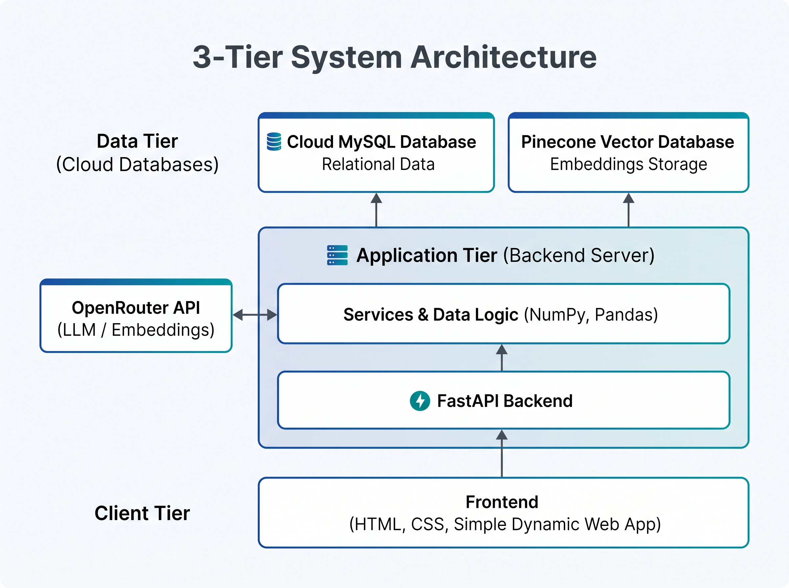

# Book Quote Finder
Book Quote Finder is a web application that lets user search for relevant book quotes. It's perfect for writers and researchers. This can be used to find the exact quote out of a book if you remember it partially. It can be also used to verify source of a specific quote. It uses semantic search to find the most relevant book quotes that match the user's query.

    

    

## Features: 
- Uses semantic search to find the most relevant book quotes
- Find a book quote from our book quotes database
- Get a book quote according to your mood
- Find relavent book quotes to include in your writing
- Get information about a specific book quote

## Tech Stack:

  
  
  

## Project Architecture:

## Related Repository

| Repository                                                               | Description                                          |
| ------------------------------------------------------------------------ | ---------------------------------------------------- |
| [Book Quote Finder Frontend](https://github.com/salishaaaa/Book_quote )  | Book Quote Finder frontend                           |
| **This Repository**                                                      | API, database, semantic search, and backend services |
